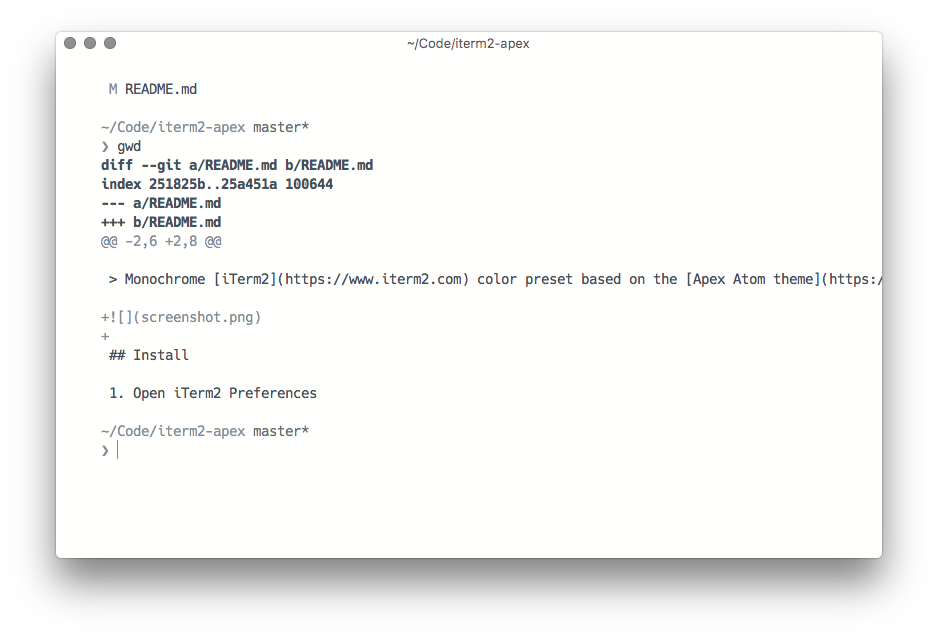

# iterm2-apex

> Monochrome [iTerm2](https://www.iterm2.com) color preset based on the [Apex Atom theme](https://github.com/apex/apex-ui).

## Install

1. Open iTerm2 Preferences
2. Navigate to Profiles, and go to the Colors tab
3. Open the Color Presets drop down menu and choose Import
4. Choose the Apex.itermcolors file

## Credits

**[@tj](https://github.com/tj)** - original [Apex UI theme](https://github.com/apex/apex-ui) (+[syntax](https://github.com/apex/apex-syntax)) for [Atom](https://atom.io).
